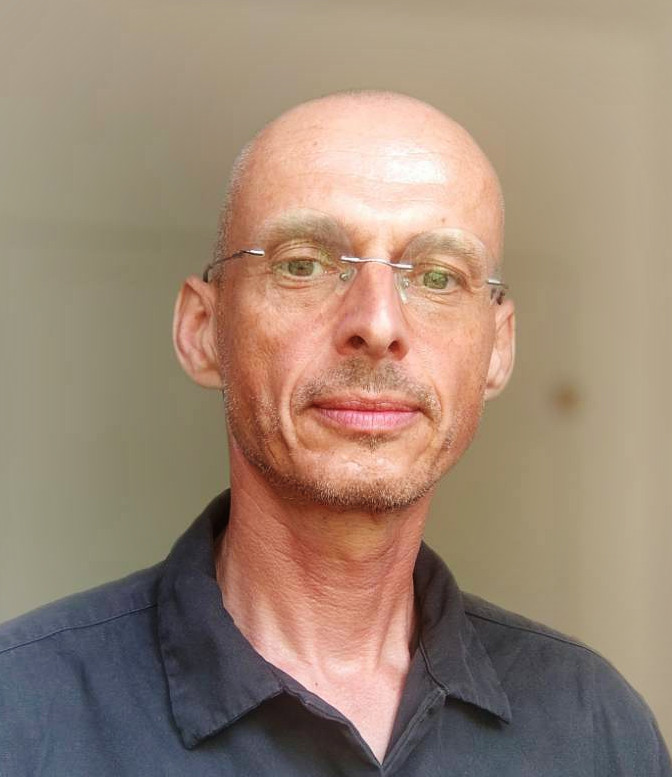

{width="28%" text-align="right"}\

# David Tolpin

[LinkedIn](https://www.linkedin.com/in/david-tolpin-1a45736/) · [GitHub](https://github.com/dtolpin) · [BitBucket](https://bitbucket.org/dtolpin/) · [Google Scholar](https://scholar.google.com/citations?user=pCIpAvIAAAAJ&hl=en) · [offtopia.net](https://offtopia.net)  
[david.tolpin@gmail.com](mailto:david.tolpin@gmail.com) · +972-54-689-1124

## Hands-on Scientist / Applied ML Researcher

Applied machine learning researcher and computer scientist with experience spanning industry R&D, production systems,
probabilistic modeling, human motion, computer vision, time-series modeling, anomaly detection, planning, and
probabilistic programming. Strong preference for roles that combine research-level problem formulation with direct
implementation, experimentation, deployment, and collaboration with engineering teams.

Recent work focuses on computer vision and graphics algorithms, 3D human motion, SMPL pose modeling, neural inverse kinematics,
pose priors, differentiable 3D modeling, and coding automation harnesses. Earlier work includes forecasting and decision-making
systems for online advertising, deterioration prediction in clinical time series, cybersecurity anomaly detection,
probabilistic programming, Bayesian inference, reinforcement learning, and heuristic search. 

## Technical Focus

**Machine learning and statistics:** Bayesian modeling, probabilistic inference, density estimation, normalizing flows,
time-series modeling, anomaly detection, forecasting, reinforcement learning, planning under uncertainty.
**Motion / vision / graphics:** markerless motion capture, SMPL human models, pose priors, inverse kinematics, differentiable 3D
modeling, computer vision and graphics algorithms.
**Systems and implementation:** production research code, distributed data processing, Go, Python, Julia, Clojure, Scala,
Unix tooling, reproducible CLI workflows.
**Research practice:** problem formulation, experiment design, papers, patents, algorithm design, scientific collaboration,
mentoring and technical leadership.

---

## Experience

### 2K — Computer Scientist

**September 2025 – Present**

Designing computer vision and graphics algorithms and automating coding harnesses. 

Selected work:

* Designed and implemented algorithms for computer vision, graphics, and 3D production workflows.
* Built automation harnesses for coding and experimentation workflows.
* Worked on practical ML/graphics problems at the boundary between research prototypes and engineering tools.

### YOOM (acquired by 2K) — Algorithm Engineer

**May 2023 – September 2025**

Worked on 3D human modeling and markerless motion-capture problems.

Selected work:

* Developed algorithms and tooling for 3D human body modeling and motion-capture pipelines.
* Worked on neural pose priors, inverse kinematics, and SMPL-based human pose representations.
* Built practical ML components intended for use by engineering teams rather than only as standalone research prototypes.
* Contributed to recent research on neural human pose priors and fast neural inverse kinematics. 

### Ben-Gurion University of the Negev — Senior Lecturer / Assistant Professor

**October 2019 – October 2025**

Research and teaching in probabilistic programming, Bayesian statistical modeling, AI planning, and reinforcement learning. 

Selected work:

* Conducted research in probabilistic programming, Bayesian inference, planning, and reinforcement learning.
* Published work on planning as policy inference, Bayesian inference reuse in multilevel models, probabilistic programs as action descriptions, stochastic conditioning, and related topics.
* Supervised and collaborated on research bridging probabilistic modeling, AI planning, and implementable inference systems.
* Taught courses "Mathematical foundations of computer science" and "Applied Bayesian data analysis".

### Wild Biotech — Machine Learning Scientist

**November 2022 – April 2023**

Designed and implemented ML and inference methods for computational biology. 

Selected work:

* Designed and coded, with colleagues, a machine learning and inference architecture for discovery and scoring of miniprotein–protein interactions.
* Invented, evaluated, and deployed a state-of-the-art method for post-processing and analysis of phage-display NGS results.
* Helped the team adopt modern software development techniques, tools, and libraries.
* Improved information flow and technical coordination in a distributed hybrid team. 

### PubPlus — Chief Data Scientist

**May 2018 – September 2022**

Led data science and statistical modeling for advertising
campaign optimization, revenue attribution, and forecasting. 

Selected work:

* Designed and helped implement a distributed architecture for data collection and processing.
* Designed forecasting algorithms that became the basis for
  automated decision-making in advertising campaign management
  and user acquisition.
* Used rigorous statistical modeling to discover and mitigate
  problems in complex data sources.
* Introduced Go into the company’s software stack and integrated
  ML/statistical modeling tasks into server-side Go services,
  partly using libraries written in-house. 

### CLEW Medical — Computer Scientist

**August 2017 – March 2018**

Worked on Bayesian inference and deep learning for clinical
time-space models and early deterioration prediction in
intensive care. 

Selected work:

* Introduced a scoring scheme for deterioration-prediction evaluation and training.
* Designed and implemented a changepoint-detection algorithm for multivariate vital-sign time series.
* Led adoption of deep-learning tools and techniques for next-generation deterioration-prediction algorithms. 

### PayPal — Research Scientist

**August 2015 – July 2017**

Applied research in anomaly detection, cybersecurity, and data science. 

Selected work:

* Designed and implemented anomaly-detection algorithms across several domains.
* Wrote approximately 20,000 lines of production/research code in Python, Scala, Lua, C, and Clojure.
* Built a data science team of four scientists.
* Led scientific collaboration with Ben-Gurion University.
* Submitted nine patent applications, contributed to two open-source projects, and co-authored four academic papers. 

### University of Oxford — Post-Doctoral Researcher

**August 2014 – July 2015**

Worked on probabilistic programming, including the Anglican
probabilistic programming system, inference algorithms, and
applications of probabilistic programming to AI. 

Selected work:

* Developed probabilistic-programming infrastructure and inference algorithms.
* Contributed to Anglican, including work later represented in highly cited publications on probabilistic programming. 
* Applied probabilistic programming to AI and decision-making problems.

### Earlier Experience

**Ben-Gurion University of the Negev — Postdoctoral Researcher / Lecturer / PhD Student**
Research in rational metareasoning and heuristic search; taught
programming languages, systems, computer architecture, compiler
construction, and related courses. 

**RenderX — CTO**
Designed and led implementation of one of the first commercial
XSL Formatting Objects engines; wrote core modules of the
formatting engine. 

**Polimetrix (acquired by YouGov) — Consultant**
Designed and developed a high-volume online survey system with
flexible tools for survey designers.

**IREX — IATP Armenia Coordinator**
Established a network of public internet access points in
Armenian universities and libraries; implemented web mail and
hosting services; taught internet literacy and web design. 

---

## Selected Publications

* **MDP Planning as Policy Inference**, arXiv 2026.
* **Bayesian Inference Reuse in Multilevel Models**, TOPML 2026.
* **Neural Human Pose Prior**, arXiv 2025.
* **Fast Neural Inverse Kinematics on Human Body Motions**, * arXiv 2025.
* **Probabilistic programs with stochastic conditioning**, ICML 2021.
* **Deployable Probabilistic Programming**, Onward! 2019.
* **Design and implementation of probabilistic programming * language Anglican**, IFL 2016.
* **Selecting computations: Theory and applications**, UAI 2014.
* **MCTS based on simple regret**, AAAI 2012.

---

## Patents

Multiple patents and patent applications across machine learning,
cybersecurity, malware detection, fraud prediction, rendering, and document
formatting. 

---

## Education

**PhD, Computer Science** — Ben-Gurion University of the Negev, 2010–2013
**MSc, Computer Science** — Ben-Gurion University, 2007–2009 

---

## Languages

English, Hebrew, Russian, Yiddish, Armenian. 
